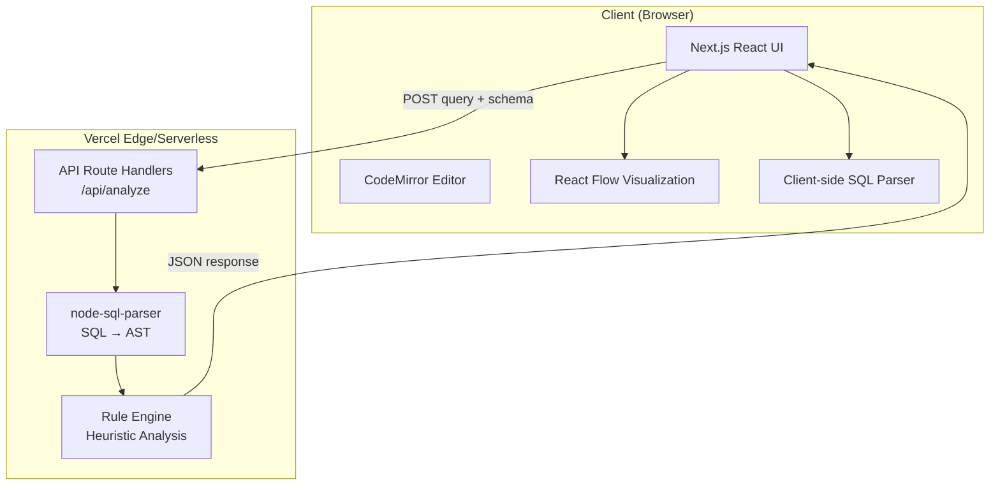
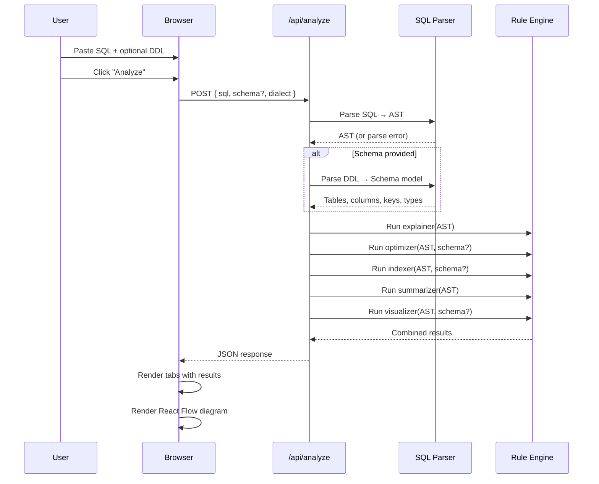
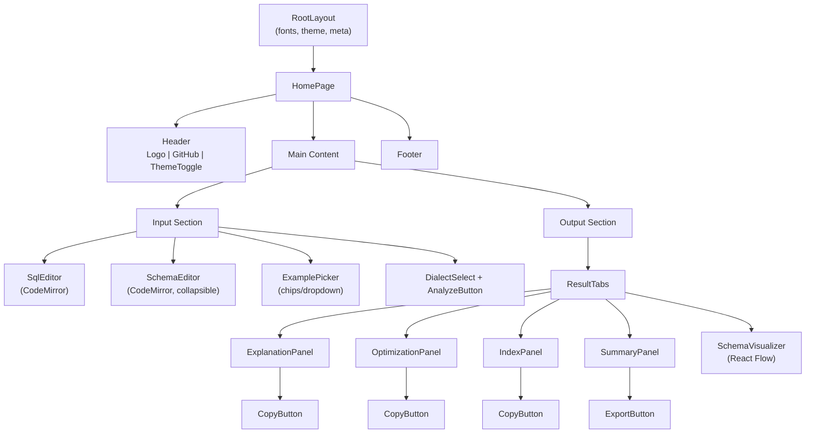

# SQLSense — Implementation Plan

A production-quality, open-source SQL analysis tool that runs entirely on Vercel's free Hobby plan with zero paid infrastructure.

---

## 1. Architecture Overview



### Key Architectural Decisions

| Decision | Choice | Rationale |
|---|---|---|
| **Framework** | Next.js 15 (App Router) | Native Vercel deployment, SSR, Route Handlers |
| **SQL Parser** | `node-sql-parser` | Multi-dialect, well-maintained, pure JS, ~200KB |
| **Visualization** | React Flow (`@xyflow/react`) | Interactive, React-native, handles custom nodes |
| **Code Editor** | CodeMirror 6 (`@uiw/react-codemirror`) | Lightweight, SQL syntax highlighting, modern |
| **Styling** | Vanilla CSS + CSS Variables | Zero runtime cost, full dark mode via variables |
| **Layout Engine** | `elkjs` (optional) | Auto-layout for schema diagrams |

### Client vs Server Split

| Concern | Runs On | Why |
|---|---|---|
| SQL editing & syntax highlight | Client | Zero latency, no server needed |
| SQL parsing → AST | **Server** (API route) | `node-sql-parser` works best in Node.js, consistent results |
| Explanation generation | **Server** | Deterministic, template-based, fast |
| Optimization hints | **Server** | Rule engine needs full AST context |
| Index suggestions | **Server** | Needs schema + query AST together |
| Schema visualization | **Client** | React Flow renders in browser, no server compute |
| Query summary | **Server** | Structured extraction from AST |
| DDL schema parsing | **Server** | Parse CREATE TABLE statements into structured JSON |
| Dark mode toggle | Client | CSS variable swap |
| Copy/export | Client | Clipboard API, no server needed |

> [!IMPORTANT]
> All server-side work happens in a **single API route** (`POST /api/analyze`) that completes in <100ms for typical queries. No background jobs, no queues, no database.

---

## 2. Repository Structure

```
sqlsense/
├── public/
│   ├── favicon.ico
│   ├── og-image.png              # Open Graph image for social sharing
│   └── examples/                 # Example SQL files (loaded client-side)
│       ├── ecommerce.sql
│       ├── analytics.sql
│       └── schemas.sql
├── src/
│   ├── app/
│   │   ├── layout.tsx            # Root layout, fonts, metadata, theme provider
│   │   ├── page.tsx              # Main page (single-page app)
│   │   ├── globals.css           # Design system tokens + global styles
│   │   └── api/
│   │       └── analyze/
│   │           └── route.ts      # POST handler: parse + analyze + respond
│   ├── components/
│   │   ├── Header.tsx            # Logo, GitHub link, dark mode toggle
│   │   ├── SqlEditor.tsx         # CodeMirror SQL editor
│   │   ├── SchemaEditor.tsx      # CodeMirror DDL editor (optional input)
│   │   ├── ExamplePicker.tsx     # Dropdown/chips to load example queries
│   │   ├── AnalyzeButton.tsx     # Primary CTA
│   │   ├── ResultTabs.tsx        # Tab container for output panels
│   │   ├── ExplanationPanel.tsx  # Plain-English query explanation
│   │   ├── OptimizationPanel.tsx # Heuristic warnings & suggestions
│   │   ├── IndexPanel.tsx        # Index suggestions with reasoning
│   │   ├── SummaryPanel.tsx      # Structured query summary (type, tables, etc.)
│   │   ├── SchemaVisualizer.tsx  # React Flow ERD diagram
│   │   ├── CopyButton.tsx        # Reusable copy-to-clipboard
│   │   ├── ExportButton.tsx      # Export results as JSON/Markdown
│   │   ├── ThemeToggle.tsx       # Dark/light mode switch
│   │   ├── Footer.tsx            # Credits, GitHub, version
│   │   └── ui/                   # Primitive UI components
│   │       ├── Tabs.tsx
│   │       ├── Badge.tsx
│   │       ├── Card.tsx
│   │       ├── Tooltip.tsx
│   │       └── Spinner.tsx
│   ├── lib/
│   │   ├── parser.ts             # SQL parsing wrapper (node-sql-parser)
│   │   ├── schema-parser.ts      # DDL → structured schema extraction
│   │   ├── explainer.ts          # AST → plain-English sentences
│   │   ├── optimizer.ts          # Heuristic rule engine
│   │   ├── indexer.ts            # Index suggestion engine
│   │   ├── summarizer.ts         # Query summary extractor
│   │   ├── visualizer.ts         # Schema → React Flow nodes/edges JSON
│   │   ├── rules/                # Individual optimization rules
│   │   │   ├── select-star.ts
│   │   │   ├── missing-where.ts
│   │   │   ├── implicit-join.ts
│   │   │   ├── subquery-in-select.ts
│   │   │   ├── function-on-indexed-col.ts
│   │   │   ├── or-vs-union.ts
│   │   │   ├── like-leading-wildcard.ts
│   │   │   └── index.ts          # Rule registry
│   │   ├── examples.ts           # Bundled example queries + schemas
│   │   └── types.ts              # Shared TypeScript types
│   └── hooks/
│       ├── useAnalyze.ts         # API call hook with loading/error state
│       └── useTheme.ts           # Dark mode hook (localStorage)
├── .gitignore
├── next.config.ts
├── tsconfig.json
├── package.json
├── vercel.json                   # Optional: region config
├── LICENSE                       # MIT
└── README.md                     # Setup, deploy, contribute
```

---

## 3. Request Flow



### API Contract

**`POST /api/analyze`**

Request:
```json
{
  "sql": "SELECT u.name, COUNT(o.id) FROM users u JOIN orders o ON u.id = o.user_id WHERE o.status = 'completed' GROUP BY u.name ORDER BY COUNT(o.id) DESC LIMIT 10;",
  "schema": "CREATE TABLE users (id INT PRIMARY KEY, name VARCHAR(100), email VARCHAR(255));\nCREATE TABLE orders (id INT PRIMARY KEY, user_id INT, status VARCHAR(20), total DECIMAL(10,2), FOREIGN KEY (user_id) REFERENCES users(id));",
  "dialect": "mysql"
}
```

Response:
```json
{
  "success": true,
  "data": {
    "explanation": {
      "summary": "This query finds the top 10 users with the most completed orders.",
      "steps": [
        "Joins the 'users' table with the 'orders' table on user ID",
        "Filters to only completed orders",
        "Groups results by user name",
        "Counts orders per user",
        "Sorts by order count (highest first)",
        "Returns only the top 10 results"
      ]
    },
    "optimization": {
      "score": 72,
      "hints": [
        {
          "severity": "warning",
          "rule": "missing-index-on-filter",
          "message": "Column 'orders.status' is used in WHERE but may lack an index",
          "suggestion": "Consider adding an index on orders(status)"
        }
      ]
    },
    "indexes": [
      {
        "table": "orders",
        "columns": ["status", "user_id"],
        "type": "composite",
        "reasoning": "Covers the WHERE filter and JOIN condition together"
      }
    ],
    "summary": {
      "queryType": "SELECT",
      "tables": [
        { "name": "users", "alias": "u" },
        { "name": "orders", "alias": "o" }
      ],
      "columns": ["u.name", "COUNT(o.id)"],
      "joins": [{ "type": "INNER JOIN", "from": "users", "to": "orders", "on": "u.id = o.user_id" }],
      "filters": ["o.status = 'completed'"],
      "groupBy": ["u.name"],
      "orderBy": [{ "expr": "COUNT(o.id)", "direction": "DESC" }],
      "limit": 10,
      "aggregates": ["COUNT"]
    },
    "visualization": {
      "nodes": [...],
      "edges": [...]
    }
  },
  "meta": {
    "parseTimeMs": 12,
    "analyzeTimeMs": 8,
    "dialect": "mysql"
  }
}
```

Error response:
```json
{
  "success": false,
  "error": {
    "code": "PARSE_ERROR",
    "message": "Syntax error at line 3, column 15: unexpected token 'FORM'",
    "suggestion": "Did you mean 'FROM'?"
  }
}
```

---

## 4. Parsing & Rule Engine Strategy

### SQL Parsing

Using `node-sql-parser` which supports MySQL, PostgreSQL, SQLite, MariaDB, and more:

```typescript
// lib/parser.ts
import { Parser } from 'node-sql-parser';

export function parseSQL(sql: string, dialect: string = 'mysql') {
  const parser = new Parser();
  const ast = parser.astify(sql, { database: dialect });
  const tableList = parser.tableList(sql, { database: dialect });
  const columnList = parser.columnList(sql, { database: dialect });
  return { ast, tableList, columnList };
}
```

### Rule Engine Architecture

Each rule is a pure function: `(ast, schema?) → Hint[]`

```typescript
// lib/rules/select-star.ts
export const selectStarRule: Rule = {
  id: 'select-star',
  name: 'SELECT * Usage',
  severity: 'warning',
  check(ast, schema) {
    if (ast.columns === '*') {
      return {
        message: 'SELECT * fetches all columns, which can be wasteful',
        suggestion: 'List only the columns you need to reduce data transfer'
      };
    }
    return null;
  }
};
```

### Planned Rules (MVP)

| Rule ID | Severity | What it Detects |
|---|---|---|
| `select-star` | warning | `SELECT *` usage |
| `missing-where` | critical | `UPDATE`/`DELETE` without `WHERE` |
| `implicit-join` | info | Comma-separated tables (old-style join) |
| `subquery-in-select` | warning | Correlated subqueries in SELECT list |
| `function-on-column` | warning | Functions wrapping indexed columns in WHERE (prevents index use) |
| `or-vs-union` | info | Multiple OR conditions that could be UNION ALL |
| `like-leading-wildcard` | warning | `LIKE '%something'` preventing index scan |
| `missing-limit` | info | Large result sets without LIMIT |
| `cartesian-product` | critical | Cross joins / missing join conditions |
| `redundant-distinct` | info | DISTINCT when primary key already ensures uniqueness |
| `order-without-index` | info | ORDER BY on non-indexed columns |
| `negation-in-where` | info | `NOT IN`, `<>`, `!=` preventing index use |

### Explanation Engine

Template-based sentence generation from AST nodes:

```typescript
// Pseudocode
function explain(ast) {
  const steps = [];
  
  if (ast.from) steps.push(`Reads from ${formatTables(ast.from)}`);
  if (ast.join) ast.join.forEach(j => steps.push(`${j.type} joins ${j.table} on ${j.on}`));
  if (ast.where) steps.push(`Filters rows where ${humanize(ast.where)}`);
  if (ast.groupby) steps.push(`Groups results by ${ast.groupby.map(g => g.column).join(', ')}`);
  if (ast.having) steps.push(`Keeps only groups where ${humanize(ast.having)}`);
  if (ast.orderby) steps.push(`Sorts by ${formatOrderBy(ast.orderby)}`);
  if (ast.limit) steps.push(`Returns ${ast.limit.value} rows`);
  
  return { summary: generateSummary(steps), steps };
}
```

---

## 5. Frontend Component Tree



### Page Layout

```
┌─────────────────────────────────────────────────────┐
│  ◆ SQLSense          [Examples ▾]  [☀/🌙]  [GitHub] │
├─────────────────────────────────────────────────────┤
│                                                     │
│  ┌─── SQL Query ──────────────────────────────────┐ │
│  │ SELECT u.name, COUNT(o.id)                     │ │
│  │ FROM users u                                   │ │
│  │ JOIN orders o ON u.id = o.user_id              │ │
│  │ WHERE o.status = 'completed'                   │ │
│  │ GROUP BY u.name                                │ │
│  │ ORDER BY COUNT(o.id) DESC LIMIT 10;            │ │
│  └────────────────────────────────────────────────┘ │
│                                                     │
│  ▸ Schema DDL (optional)        [MySQL ▾] [Analyze] │
│                                                     │
├─────────────────────────────────────────────────────┤
│                                                     │
│  [Explanation] [Optimize] [Indexes] [Summary] [ERD] │
│  ─────────────────────────────────────────────────  │
│  │                                               │  │
│  │  📝 Plain-English Explanation                 │  │
│  │                                               │  │
│  │  This query finds the top 10 users with the   │  │
│  │  most completed orders.                       │  │
│  │                                               │  │
│  │  Step by step:                                │  │
│  │  1. Joins users with orders on user ID        │  │
│  │  2. Filters to only completed orders          │  │
│  │  3. Groups results by user name               │  │
│  │  4. Counts orders per user                    │  │
│  │  5. Sorts by count (highest first)            │  │
│  │  6. Returns only the top 10                   │  │
│  │                                       [Copy]  │  │
│  └───────────────────────────────────────────────┘  │
│                                                     │
├─────────────────────────────────────────────────────┤
│  Built with ♥ · MIT License · GitHub                │
└─────────────────────────────────────────────────────┘
```

---

## 6. Design System

### Color Palette (CSS Variables)

```css
/* Light Mode */
--bg-primary: #ffffff;
--bg-secondary: #f8f9fc;
--bg-tertiary: #f0f2f7;
--text-primary: #1a1d2e;
--text-secondary: #5a5f7a;
--text-muted: #9098b3;
--accent: #6366f1;        /* Indigo — primary brand */
--accent-hover: #4f46e5;
--accent-soft: #eef2ff;
--success: #10b981;
--warning: #f59e0b;
--danger: #ef4444;
--info: #3b82f6;
--border: #e5e7eb;
--surface: #ffffff;

/* Dark Mode */
--bg-primary: #0f1117;
--bg-secondary: #161822;
--bg-tertiary: #1e2030;
--text-primary: #e8eaed;
--text-secondary: #9ca3af;
--accent: #818cf8;
--accent-soft: rgba(99, 102, 241, 0.12);
--border: #2a2d3e;
--surface: #1a1c2a;
```

### Typography
- **Font**: Inter (Google Fonts) — clean, developer-friendly
- **Monospace**: JetBrains Mono — for SQL code
- **Scale**: 14px base, modular scale for headings

### Micro-interactions
- Tab switching: slide indicator animation
- Analyze button: subtle pulse when ready, loading spinner during request
- Result panels: fade-in on load
- Copy button: checkmark animation on success
- Theme toggle: smooth color transition (200ms)
- Schema DDL: smooth accordion expand/collapse

---

## 7. Deployment Structure

### Vercel Configuration

```json
// vercel.json
{
  "framework": "nextjs",
  "regions": ["iad1"],
  "functions": {
    "src/app/api/analyze/route.ts": {
      "maxDuration": 10
    }
  }
}
```

### Vercel Hobby Plan Compliance

| Constraint | Our Approach | Status |
|---|---|---|
| **No database** | All analysis is stateless, per-request | ✅ |
| **No Redis/queues** | Single synchronous request/response | ✅ |
| **No background jobs** | Everything completes in one request | ✅ |
| **No file uploads** | Text input only (SQL strings) | ✅ |
| **No auth** | Public tool, no login | ✅ |
| **<10s function timeout** | SQL parsing + analysis takes <100ms | ✅ |
| **<4.5MB response** | JSON responses are tiny (<50KB) | ✅ |
| **<250MB bundle** | Lean dependencies only | ✅ |
| **No paid compute** | Heuristic rules, no AI inference | ✅ |

### Deployment Steps (for README)

```bash
# 1. Fork the repo
# 2. Connect to Vercel
npx vercel link
# 3. Deploy
npx vercel deploy --prod
# Or: Import from GitHub in Vercel Dashboard (recommended)
```

---

## 8. Bundled Examples

### Example 1: E-commerce Analytics
```sql
-- Query: Top customers by revenue
SELECT c.name, c.email, SUM(o.total) as total_spent, COUNT(o.id) as order_count
FROM customers c
JOIN orders o ON c.id = o.customer_id
JOIN order_items oi ON o.id = oi.order_id
WHERE o.created_at >= '2024-01-01'
  AND o.status IN ('completed', 'shipped')
GROUP BY c.id, c.name, c.email
HAVING SUM(o.total) > 1000
ORDER BY total_spent DESC
LIMIT 20;
```

With schema:
```sql
CREATE TABLE customers (id INT PRIMARY KEY, name VARCHAR(100), email VARCHAR(255), created_at TIMESTAMP);
CREATE TABLE orders (id INT PRIMARY KEY, customer_id INT, total DECIMAL(10,2), status VARCHAR(20), created_at TIMESTAMP, FOREIGN KEY (customer_id) REFERENCES customers(id));
CREATE TABLE order_items (id INT PRIMARY KEY, order_id INT, product_id INT, quantity INT, price DECIMAL(10,2), FOREIGN KEY (order_id) REFERENCES orders(id));
CREATE TABLE products (id INT PRIMARY KEY, name VARCHAR(200), category VARCHAR(50), price DECIMAL(10,2));
```

### Example 2: User Analytics Dashboard
```sql
-- Active users with session stats
SELECT u.username, COUNT(DISTINCT s.id) as sessions,
       AVG(s.duration_minutes) as avg_duration,
       MAX(s.started_at) as last_active
FROM users u
LEFT JOIN sessions s ON u.id = s.user_id
WHERE s.started_at >= DATE_SUB(NOW(), INTERVAL 30 DAY)
GROUP BY u.id, u.username
ORDER BY sessions DESC;
```

### Example 3: Problematic Query (for optimization demos)
```sql
-- Intentionally sub-optimal query
SELECT *
FROM orders, customers
WHERE orders.customer_id = customers.id
  AND YEAR(orders.created_at) = 2024
  AND orders.total > 100
  OR customers.name LIKE '%smith%'
ORDER BY orders.created_at;
```

---

## 9. MVP vs Later Roadmap

### MVP (v1.0) — This Implementation

- [x] SQL parsing with `node-sql-parser` (MySQL, PostgreSQL, SQLite)
- [x] Plain-English query explanation
- [x] 12+ heuristic optimization rules
- [x] Index suggestion engine with reasoning
- [x] Structured query summary
- [x] Schema visualization (React Flow)
- [x] Dark mode
- [x] Example queries + schemas
- [x] Copy/export results
- [x] Responsive design
- [x] Vercel one-click deploy
- [x] MIT license
- [x] Comprehensive README

### v1.1 — Polish

- [ ] Query diff (compare before/after optimization)
- [ ] Shareable URLs (encode query in URL hash)
- [ ] Keyboard shortcuts
- [ ] Query history (localStorage)
- [ ] More SQL dialects (T-SQL, Oracle, BigQuery)

### v2.0 — Advanced

- [ ] Query execution plan simulation (estimated cost model)
- [ ] AI-powered suggestions (optional, using free-tier AI APIs)
- [ ] Query formatting/beautification
- [ ] Multi-statement support
- [ ] Schema import from SQL dump files
- [ ] Embeddable widget mode
- [ ] VS Code extension
- [ ] CLI tool (`npx sqlsense "SELECT ..."`)

---

## 10. Verification Plan

### Automated Checks
```bash
# TypeScript compilation
npm run build

# Lint
npm run lint

# Dev server
npm run dev
```

### Browser Testing
1. Load the app and verify dark/light mode toggle
2. Paste example SQL → click Analyze → verify all 5 tabs populate
3. Paste SQL with schema DDL → verify ERD visualization renders
4. Test with intentionally bad SQL → verify error message shows
5. Test example picker loads queries correctly
6. Test copy/export buttons
7. Test responsive layout on mobile viewport
8. Verify Vercel deployment succeeds

### Performance Validation
- API response time < 200ms for typical queries
- Lighthouse score > 90 on all categories
- Bundle size < 500KB gzipped (excluding CodeMirror)

---

## Open Questions

> [!IMPORTANT]
> **SQL Dialect Default**: Should the default dialect be MySQL or PostgreSQL? MySQL has the largest user base, but PostgreSQL is more popular among developers. I'm leaning toward **MySQL as default** with a dropdown to switch. Let me know your preference.

> [!NOTE]
> **Schema Visualization Scope**: For MVP, the schema visualizer will render tables from DDL input as an ERD with columns, types, and foreign key relationships. It will NOT visualize the query execution flow (that's a v2 feature). Is this acceptable?

> [!NOTE]
> **Export Format**: Planning to support "Copy as Markdown" and "Copy as JSON" for results. Should we also include "Copy as plain text" or is Markdown + JSON sufficient?

---

Please review this plan and let me know if you'd like any changes before I begin implementation.
